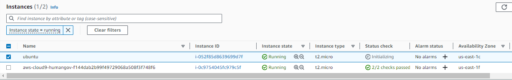
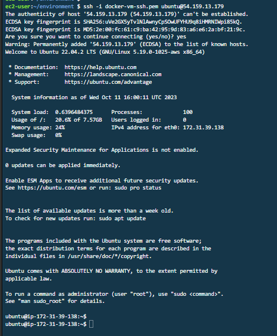
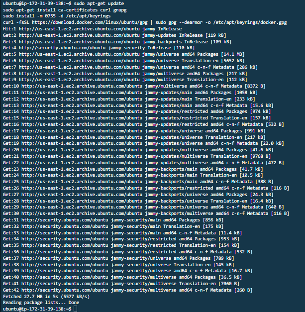
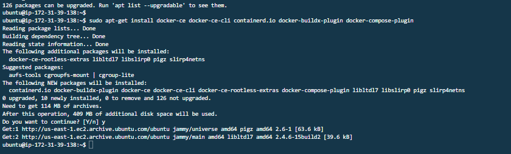
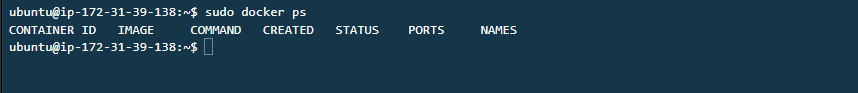
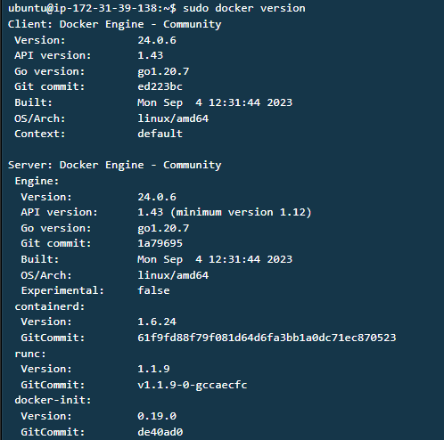
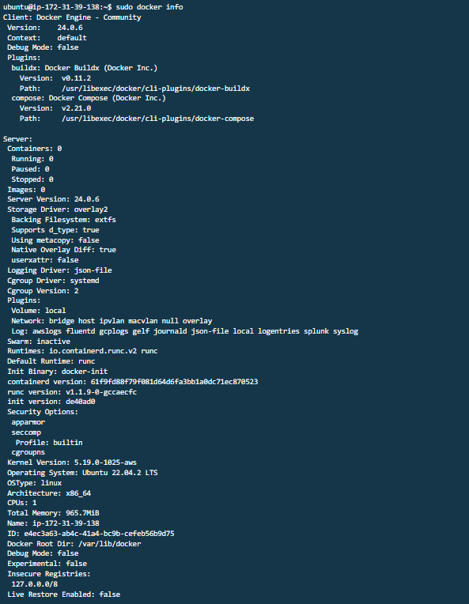
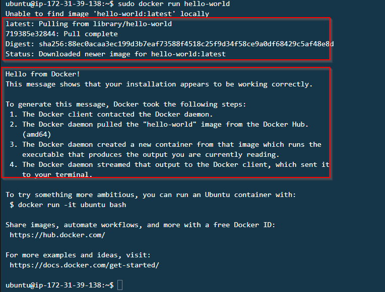

# Docker Fundamentals | PART 1: Getting started with Docker on AWS


# Creating an AWS EC2 (VM):

Access AWS and navigate to EC2:

- **Image**: Ubuntu 22.04
- **Instance Type**: t2.micro
- **Key Pairs**: docker-vm-ssh
- **VPC**: Default
- **Security Group (Firewall)**: docker-vm-sg


# Accessing EC2:

Download the private key to a directory that will be used to EC2 instance via ssh. Change permissions of the key using `chmod 600` and use SSH to access your EC2 instance:

```
ssh -i docker-vm-ssh.pem ubuntu@ec2-public-ip

```


---

# Installing Docker on Ubuntu Linux

**Install using the Apt repository**
Before you install Docker Engine for the first time on a new host machine, you need to set up the Docker repository. Afterward, you can install and update Docker from the repository.

# 1. Add Docker's official GPG key:

Enter the following commands one at time to add Docket's official GPG key to your systems. This will be use to authenticate the server to have access to install docker. 

```
sudo apt-get update
sudo apt-get install ca-certificates curl gnupg
sudo install -m 0755 -d /etc/apt/keyrings
curl -fsSL https://download.docker.com/linux/ubuntu/gpg | sudo gpg --dearmor -o /etc/apt/keyrings/docker.gpg
sudo chmod a+r /etc/apt/keyrings/docker.gpg
```



# 2. Add the repository to Apt sources:

```
echo \
  "deb [arch="$(dpkg --print-architecture)" signed-by=/etc/apt/keyrings/docker.gpg] https://download.docker.com/linux/ubuntu \
  "$(. /etc/os-release && echo "$VERSION_CODENAME")" stable" | \
  sudo tee /etc/apt/sources.list.d/docker.list > /dev/null
sudo apt-get update
```


# 3. install the latest version of Docker packages
To install the latest version, run 

```sudo apt-get install docker-ce docker-ce-cli containerd.io docker-buildx-plugin docker-compose-plugin
```



# 4. Test Docker:

To know our Docker application is installed correctely I run the following command to see the running containers.

```sudo docker ps
```
I have the following output:

 

I can also verify the Docker version and info with the following commands:

```
docker version
docker info

```





# 5. Verify that the Docker installation is successfully by running the `hello world` image.
This command downloads a test image and runs it in a container. When the container runs, it prints a confirmation massage and exits. 




# Manage Docker as a non-root user

*Warning*
The docker group grants root-level privileges to the user. For details on how this impacts security in your system, see [Docker Daemon Attack Surface.](https://docs.docker.com/engine/security/#docker-daemon-attack-surface)


1. Create the docker group
```
$ sudo groupadd docker
```

2. Add your user to the docker group
```
$ sudo usermod -aG docker $USER
```

3. Log out and log back in so that your group membership is re-evaluated. 
*If you're running Linux in a virtual machine, it may be necessary to restart the virtual machine for changes to take effect.If you're running Linux in a virtual machine, it may be necessary to restart the virtual machine for changes to take effect.*

You can also run the following commands to activate the changes to groups. 
```
$ newgrp docker
```

4. Verify that you can run docker commands without sudo 
```
$ docker run hello-world
```

# Stop the AWS EC2 instance running Docker

Access AWS, navigate to EC2, and then stop the VM created for Docker usage.

# Appendix I - Installing Docker on Mac

Follow the instructions at [Docker’s official documentation](https://docs.docker.com/desktop/install/mac-install/)

# Appendix II - Installing Docker on Windows (WSL)

Follow the instructions at [Docker’s official documentation](https://docs.docker.com/desktop/wsl/)

# Appendix III - Docker post installation.

Follow the following  steps to setup your docker container after installation at [Post installation](https://docs.docker.com/engine/install/linux-postinstall/)

# Appendix IV 

Follow the link to learn more Docker commands at [Docker]( https://dockerlabs.collabnix.com/docker/cheatsheet/ )