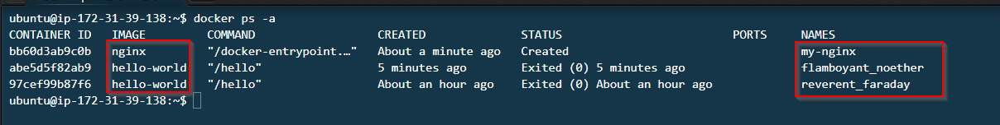
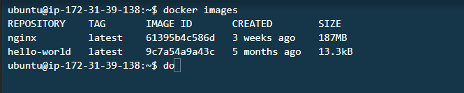

# Hands-on: Part 2 COMMANDING DOCKER


In this hands-on exercise, we will dive into some of the most essential Docker commands. Docker is a versatile tool for containerizing applications, making it easier to build, ship, and run them consistently across various environments. With these commands, you'll have the ability to effectively manage containers, images, volumes, and networks.

## Starting the AWS EC2 Instance Running Docker

To begin, access your AWS account, navigate to EC2, and start the virtual machine (VM) that has been set up for Docker usage.

## Getting Started

Let's walk through the steps to get started with this exercise:

1. **Verify Docker Installation:**

   Ensure that Docker is installed correctly by running the following command:

   ```bash
   docker --version
   ```
   

2. **Pulling an Image:**

   Pull an image from a Docker registry. For instance, let's grab the `nginx` image from DockerHub and download it to our local machine:

   ```bash
   docker pull nginx
   ```
   

   Confirm that the image was successfully downloaded using the following command, which provides information about your Docker images, including the repository, tag, image ID, and size:

   ```bash
   docker images
   ```
    
3. **Creating a Container:**

   Create a Docker container named `my-nginx` using the following command:

   ```bash
   docker create --name my-nginx nginx
   ```

4. **Starting the Container:**

   Initiate the container you've just created with the command:

   ```bash
   docker start my-nginx
   ```

5. **Listing Running Containers:**

   Check the list of currently running containers:

   ```bash
   docker ps
   ```
    
6. **Listing All Containers:**

   To see all containers, regardless of their status, use:

   ```bash
   docker ps -a
   ```
    
7. **Filtering Containers by Status:**

   You can filter and list containers by their status. For instance, to list all containers that have exited, run:

   ```bash
   docker ps -f status=exited
   ```
   
8. **Stopping a Running Container:**

   To stop a running container, replace `{container_name}` with the actual name or ID of the container:

   ```bash
   docker stop {container_name}
   ```

9. **Removing a Stopped Container:**

   If you need to remove a stopped container, use:

   ```bash
   docker rm {container_name}
   ```

10. **Forcefully Stopping and Removing a Container:**

    For situations requiring a forceful stop and removal of a container, you can achieve it with:

    ```bash
    docker kill {container_name}
    ```

11. **Listing Images:**

    To display a list of all Docker images, execute:

    ```bash
    docker images
    ```
    
12. **Removing an Image:**

    If you need to remove an image, replace `{image_id}` with the actual ID, tag, or digest of the image:

    ```bash
    docker rmi {image_id}
    ```

13. **Running an Interactive Container:**

    Run a container and attach your terminal's standard input, output, and error streams to it:

    ```bash
    docker run -it --name interactive-nginx nginx /bin/bash
    ```
    

    Take note as the console environment changes from our EC2 user environment to the docker interraction bash shell with a root user. To exit from the docker console just type in the `exit` and press enter from your keyboard. 

14. **Running a Detached Container:**

    Execute a container in detached mode using command below. This allow the docker container to run in the background while freeing the console so that you can perform other task. Normally containers will be launched to run in the back ground we will always launch container instances  in a detached mode.

    ```bash
    docker run -d --name detached-nginx nginx
    ```
    
15. **Executing a Command in a Running Container:**

    To run a command within a running container, opening a bash shell inside it, you can use the following:

    ```bash
    docker exec -it {container_name} bash
    ```
    

Remember to replace `{container_name}` and `{image_id}` with your specific container names and image IDs. Keep in mind that running a container in detached mode means it operates in the background, while running it in attached or interactive mode places it in the foreground, allowing direct interaction from your terminal.