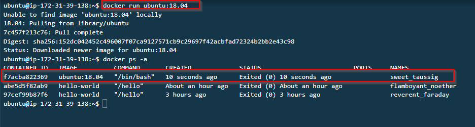

# Hands-on: COMMANDING DOCKER - Part 2


Continuing from where we left off IN PART 1, let's further explore Docker commands.

## Start the AWS EC2 instance running Docker

Access AWS, navigate to EC2, and then start the VM created for Docker usage.

Follow the steps below to get started with this exercise:

1. In some cases, images come with different versions or configurations, referred to as "tags". To specify a tag while running a container, use the following format:
    
    ```
    docker run ubuntu:18.04
    
    ```
    
    In this example,  I am running an Ubuntu container using the 18.04 tag (version).
    
2. If you want to run a container in detached mode, give it a name, and specify the image tag, use the following command:
    
    ```
    docker run -d --name my-nginx nginx:latest
    
    ```
    
    Here, `my-nginx` is the name of the container, `nginx` is the image, and `latest` is the tag.
    
3. To expose a port from the container to your host machine, use the `p` option. This is helpful if the container is running a web server or any application that   needs to communicate over a specific port. At first this will not work since our EC2 instance only allows connection on port 22 in the configured security group. I updated the security group of my EC2 instance to allow traffic coming from anywhere to port `8080` in the AWS EC2 management console. 

* select Ubuntu(EC2 instance) > Security > Security Groups > Inboud Rules > Edit inbound rules > Add rule. 


    
    ```
    docker run -d -p 8080:80 --name my-nginx nginx:latest
    
    ```

    

    This command runs a new `nginx` container named `my-nginx` in detached mode. The `-p 8080:80` option maps the host port 8080 to the container's port 80. If everything works well we should be able to access the default nginx  web interface via our EC2 instance public IP address on port 8080. 

    

    
4. To inspect the details of a running container, use the `docker inspect` command followed by the container's ID or name:
    
    ```
    docker inspect my-nginx
    
    ```
    
    
    This command provides a JSON output that includes configuration details, status, network settings, and many more details about the container.

    ```bash
    ubuntu@ip-172-31-39-138:~$ docker inspect my-nginx
[
    {
        "Id": "d2fc29d0c9a83dd7e6217a16296923ec28676dd7f952c13c6a9befef0c62485b",
        "Created": "2023-10-11T20:10:06.430606375Z",
        "Path": "/docker-entrypoint.sh",
        "Args": [
            "nginx",
            "-g",
            "daemon off;"
        ],
        "State": {
            "Status": "running",
            "Running": true,
            "Paused": false,
            "Restarting": false,
            "OOMKilled": false,
            "Dead": false,
            "Pid": 1627,
            "ExitCode": 0,
            "Error": "",
            "StartedAt": "2023-10-11T20:10:06.848292818Z",
            "FinishedAt": "0001-01-01T00:00:00Z"
        },
        "Image": "sha256:61395b4c586da2b9b3b7ca903ea6a448e6783dfdd7f768ff2c1a0f3360aaba99",
   

        "Name": "/my-nginx",
        "RestartCount": 0,
        "Driver": "overlay2",
        "Platform": "linux",
       
            "Image": "nginx:latest",
    
                 |
        "NetworkSettings": {
            "Bridge": "",
            "SandboxID": "a03626da1e4db72ce42ccc13ae819b834bf81e1f304332be39082ab1cf06d6dc",
            "HairpinMode": false,
            "LinkLocalIPv6Address": "",
            "LinkLocalIPv6PrefixLen": 0,
            "Ports": {
                "80/tcp": [
                    {
                        "HostIp": "0.0.0.0",
                        "HostPort": "8080"
                    },
                    {
                        "HostIp": "::",
                        "HostPort": "8080"
                    }
                ]
            },
         
            "GlobalIPv6Address": "",
            "GlobalIPv6PrefixLen": 0,
            "IPAddress": "172.17.0.2",
            "IPPrefixLen": 16,
            "IPv6Gateway": "",
            "MacAddress": "02:42:ac:11:00:02",
            "Networks": {
                "bridge": {
                    "IPAMConfig": null,
                    "Links": null,
                    "Aliases": null,
                    "NetworkID": "a2eda2b2f8c3808b997141c2e5811ece0562e8a7b908affbc00add4ccb17bb71",
                    "EndpointID": "05f5df6c9dd97cc00e71f7e7ed8b4bb1ae95e33e2df6774bbec7c2615f3e0981",
                    "Gateway": "172.17.0.1",
                    "IPAddress": "172.17.0.2",
                    "IPPrefixLen": 16,
                    "IPv6Gateway": "",
                    "GlobalIPv6Address": "",
                    "GlobalIPv6PrefixLen": 0,
                    "MacAddress": "02:42:ac:11:00:02",
                    "DriverOpts": null
                }
            }
        }
    }
]
    
    ```
    
5. If you want to see the logs that a running container has produced, use the `docker logs` command:
    
    ```
    docker logs my-nginx
    
    ```
    
    This command displays the standard output and standard error of the container. It's very helpful for debugging purposes.
    

Remember to replace `my-nginx`, `ubuntu:18.04`, and `nginx:latest` with the names, images, and tags of your containers.
