# Hands-on: Docker Images


 Docker has become a cornerstone technology for building, packaging, and deploying applications. As a developer or DevOps enthusiast, learning the ropes of Docker is essential. In this hands-on tutorial, we will embark on a journey to explore Docker images. Each step is designed to help you understand the process from start to finish.
# Start the AWS EC2 instance running Docker

Before we dive into Docker images, we need a Docker-ready environment. Amazon Web Services (AWS) offers a robust infrastructure, and we start by launching an EC2 instance equipped with Docker. This instance will serve as our creative workspace for crafting Docker images.

# Cleaning the Environment:

An artist needs a clean canvas, and so does a Docker image creator. By executing docker system prune, we tidy up our Docker environment. This step ensures that we have a fresh and clutter-free canvas for our Docker images.

```
docker system prune -a -f --volumes

```

# Create a new directory and switch to it:
Organizing your work is crucial. We create a new directory named docker-images and navigate to it. This dedicated workspace keeps our Docker image-related files neatly organized and accessible.

```
mkdir docker-images
cd docker-images

```

# Create a index.html file with the content below:
An image is more than code; it's an application with character. We begin by creating an index.html file, designed with a simple yet elegant structure. To add personality, we also craft a style.css file. These files form the soul of our Docker image.

```html
<!DOCTYPE html>
<html lang="en">
<head>
    <meta charset="UTF-8">
    <meta http-equiv="X-UA-Compatible" content="IE=edge">
    <meta name="viewport" content="width=device-width, initial-scale=1.0">
    <link rel="preconnect" href="https://fonts.googleapis.com">
    <link rel="preconnect" href="https://fonts.gstatic.com" crossorigin>
    <link href="https://fonts.googleapis.com/css2?family=Roboto+Mono:wght@100&display=swap" rel="stylesheet">
    <link rel="stylesheet" href="style.css">
    <title>TCB: Python Image</title>
</head>
<body>
    
     <h1>This is The Cloud Bootcamp</h1>
     <h2>DevOps Cloud Bootcamp</h2>

     
    
</body>
</html>
```

Create a style.css file with the content below:

```css
body{
    padding: 0;
    margin: 0;
    border: 0;
    background: rgb(24, 27, 30);
    text-align: center;
    font-size: 20px;    
}

h1{
    padding-top: 50px ;
    color: rgb(11, 237, 105);
    transition: 4s;
    font-family: roboto mono;    
}

h2{
    color: rgb(11, 237, 105);
    transition: 5s;
    font-family: roboto mono;
}
```


# Create a Dockerfile:
he Dockerfile is the blueprint of our image. In it, we specify the base image (Python 2.7), set the working directory, copy our HTML and CSS files, define the exposed port, and launch a Python HTTP server. It's the core recipe for our Docker image.

```docker
FROM python:2.7
WORKDIR /html
COPY index.html .
EXPOSE 3000
CMD python -m SimpleHTTPServer 3000

```

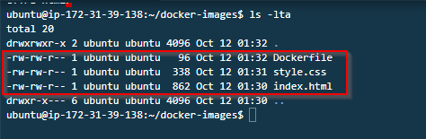
---

**Note:** SimpleHTTPServer is a Python module that allows you to instantly create a web server or serve your files easily. You don't need to install anything as long as you have Python interpreter installed.

---

# Build the Docker image:
With our Dockerfile ready, we proceed to build our Docker image using the docker build command. This step blends the Dockerfile's instructions with the application's code, creating a coherent masterpiece - our Docker image.

```
docker build . -t python-simple-httpserver:v1.0

```
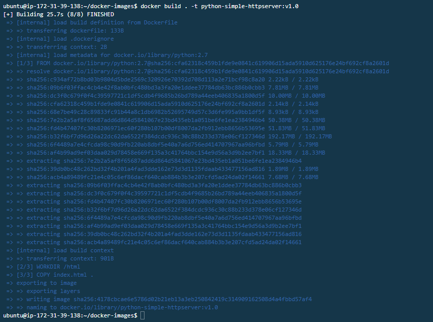
Check your Docker images:
After the build, we use docker images to reveal our newly crafted Docker image. This step ensures that our creation is ready for action, and it's the moment where our creation comes to life.
```
docker images

```
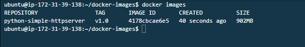


Create and Start a new Docker Container using the Docker image created:

```
docker run --rm -d -p 8080:3000 --name httpserver1 python-simple-httpserver:v1.0

```
After running the docker container check the running instances. 
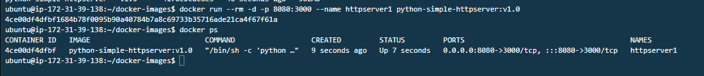

<aside>
💡 Test the webserver on post 8080. You’ll notice it will fail because you need to allow the port on Security Group. Open the port on the respective security group.

</aside>
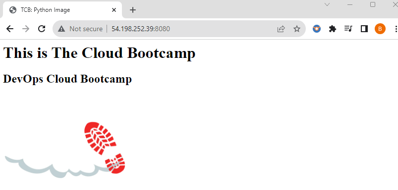

# Changing the Dockerfile:
An artist never stops evolving. In this step, we enhance our Docker image by modifying the Dockerfile to include all project files. With these changes, we create version 2.0 of our image.

```docker
FROM python:2.7
WORKDIR /html
**COPY . .**
EXPOSE 3000
CMD python -m SimpleHTTPServer 3000

```

Build the Docker image:

```
docker build . -t python-simple-httpserver:v2.0

```
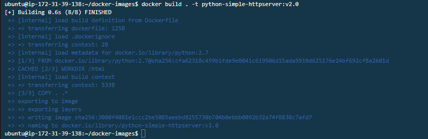
Check your Docker images:

```
docker images

```
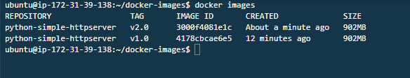
Create and Start a new Docker Container using the new image:

```

docker run --rm -d -p 8081:3000 --name httpserver2 python-simple-httpserver:v2.0

```
Our 2 docker versions are live but running on separate ports 
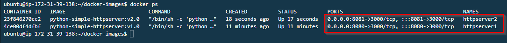

Now we can test version 2 of our application via the browser after editing the Dockerfile. Everything is working perfectly okay 
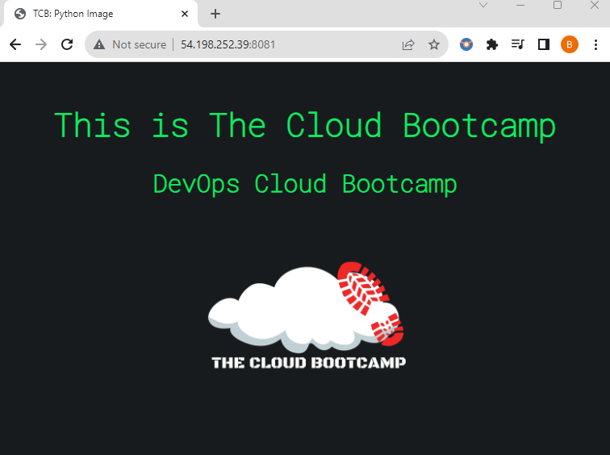

# Create a free account on DockerHub
Follow the link below to create a free account on DockerHub where you will be able to push your images. 

[https://hub.docker.com](https://hub.docker.com/)

# Docker Tag:

Tag your Docker image:

```
docker tag <imageid> <userid>/python-simple-httpserver:v2.0

```
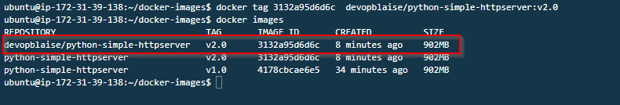

# Docker Push:
To share our creation with the world, we need to upload it to a central repository. We create a DockerHub account, tag our Docker image, and push it to the repository. This step ensures that our image is accessible for others to use.

```
docker login

```
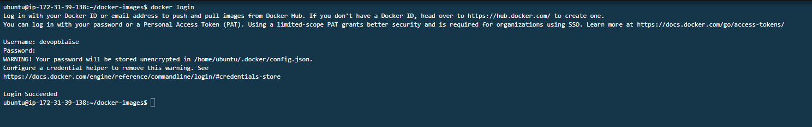

# Push your Docker image to the repository:
Now all we  have to do is pust our image to the dockerhub repo.

```
docker push <userid>/python-simple-httpserver:v2.0
```
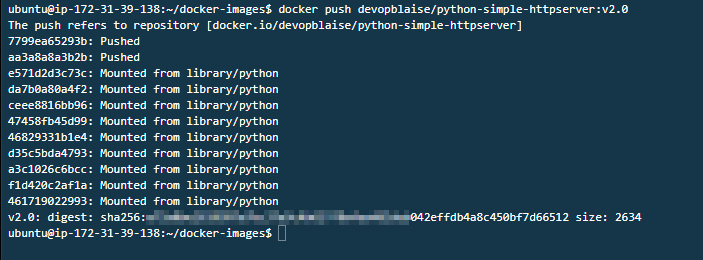

let's chech our dockerhub repo to for make sure our images was pushed. 
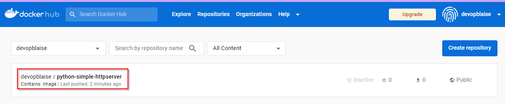

# Docker Container Process Info:
Finally, we explore running Docker containers with `docker top` and gather statistics using `docker stats`. This step helps us gain insights into the processes and performance of our Docker image.

`docker top` give us more information from  a running processes in a container like user ID, Process ID, start time of a process, the command started the process and how many times it has been executed. 

```
docker top <containerid>
```
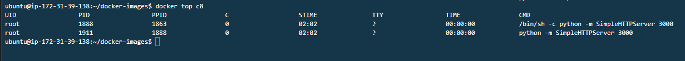

`docker stat` give us Statistics about our running docker container such as CPU usage, memory usage, network etc.

```
docker stats 
```
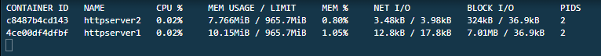