# Hands-on: Docker Storage Demystified


Are you ready to dive into the world of Docker storage solutions? Docker is known for its agility and efficiency, but understanding storage management can be a bit tricky. In this hands-on guide, we will walk you through each step, providing not just the "how" but also the "why" behind each action. Let's explore the world of Docker storage together.

# Step 1: Start the AWS EC2 instance running Docker

Before we dive into Docker storage, we need a platform to work on. We'll start by launching an AWS EC2 instance configured for Docker usage. Amazon Web Services (AWS) provides a robust and flexible environment for running Docker containers.

Why? AWS offers scalability, security, and reliability, making it an excellent choice for Docker deployments.

After setting up the EC2 instance log on to it via ssh. 

# Step 2: Cleaning the Environment

Maintaining a clean Docker environment is crucial. We start by running:

```shell
docker system prune -a -f --volumes
```
This command cleans up unused containers, images, and volumes, saving disk space and reducing clutter in your Docker setup.

Why? Regular cleaning prevents resource wastage and ensures your system runs smoothly.

# Step 3: Create a New Directory
Next, we create a dedicated directory for our Docker images. We run:

```shell
mkdir docker-volumes
cd docker-volumes
```
Having an organized structure makes it easier to manage and access your Docker images and configurations. Organizing your work ensures a clear and structured workflow.

# Step 4: Download and Unzip Task Files

Now we fetch the task files we need. By running:

```shell
wget https://tcb-bootcamps.s3.amazonaws.com/tcb5001-devopscloud-bootcamp/v2/module5-docker/files/module5-docker.zip
sudo apt install unzip
unzip module5-docker.zip
cd handsontask/volumes
```
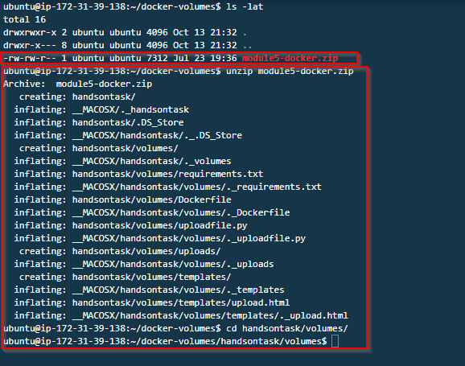

We download the necessary resources for our Docker project. These files contain configurations and code needed to build and run Docker containers.

# Step 5: Build the Docker Image
Before building our image, let's check the content of this directory houseing files used to build our docker image.
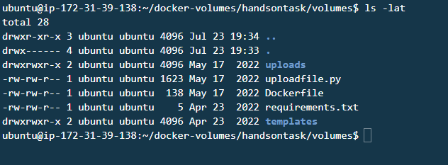
It's time to create our Docker image:

```shell
docker build . -t tcb-img-upload-file:v1.0
```
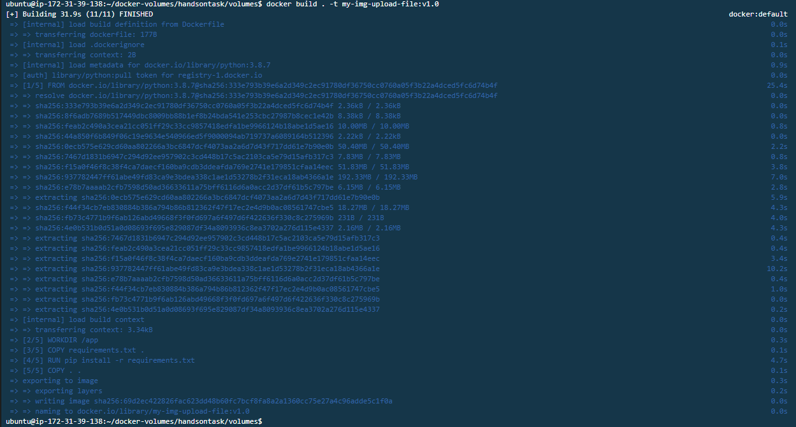
Building a Docker image is a fundamental step in containerization. You define your application and its dependencies in a Dockerfile, and this image can be used to launch containers consistently. Docker images encapsulate your application, ensuring portability and reproducibility.

Check your Docker images:

```shell
docker images
```
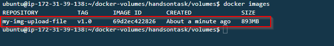

# Step 6: Running a Container Without Data Persistence
We launch a container without data persistence using:

```shell
docker run --rm -d -p 8081:3000 --name ctr-upload-file tcb-img-upload-file:v1.0
```
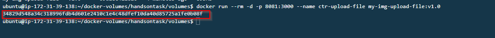

This means that when the container is stopped, any data changes within it are lost. Sometimes, you need containers with no data persistence for temporary tasks or stateless applications.

List files in the container and uploads directory:

```shell
docker exec <containerid> ls
ls uploads
```
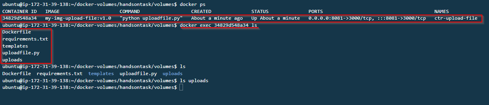

Stop the container:

```shell
docker stop <containerid>
```

Run the container again:

```shell
docker run --rm -d -p 8081:3000 --name ctr-upload-file tcb-img-upload-file:v1.0
```

List files in the container and uploads directory:

```shell
docker exec <containerid> ls
ls uploads
```
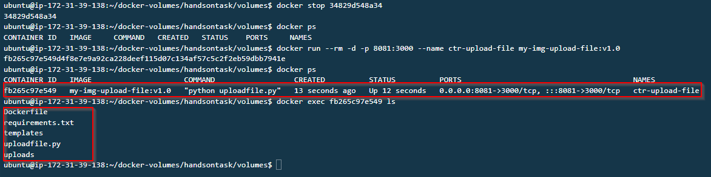


# Step 7: Creating a Volume
We explore Docker volumes, a way to manage data persistence. We run:

````shell
docker volume ls
docker volume create upload-files
docker volume ls
sudo ls -l /var/lib/docker/volumes
````

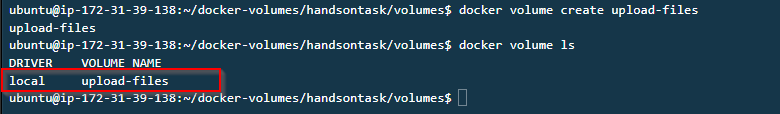


```shell
sudo ls -l /var/lib/docker/volumes
```
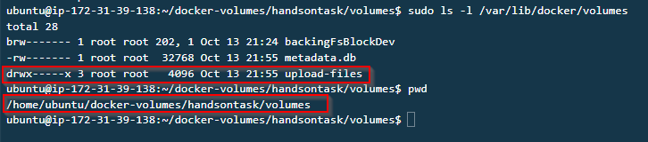

Docker volumes offer a more robust way to handle data storage in containers, with various use cases. Volumes ensure data survives container destruction and allows sharing data between containers.

Stop the container:

```shell
docker stop <containerid>
```

# Step 8: Volume Persistence Managed by Docker

Run the container with a Docker volume:

```shell
docker run --rm -d -p 8081:3000 --name ctr-upload-file -v upload-files:/app/uploads tcb-img-upload-file:v1.0
docker inspect <containerid> | grep volume
```
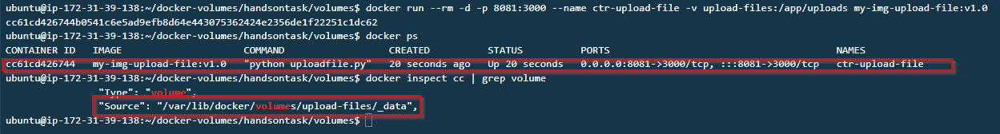
This setup ensures data stored in the volume survives container restarts or replacements. Volume persistence is crucial for databases, file storage, and other stateful applications.

# Upload a new file
we will access our application via the web browser on port 8081 and try a upload a file  

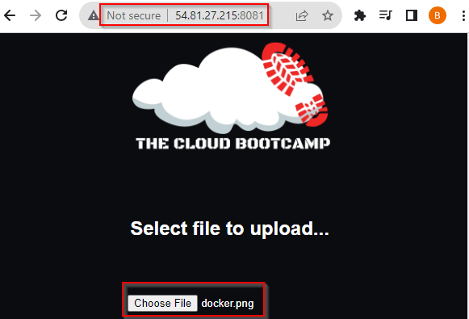

List files in the container and uploads directory:

```shell
docker exec <containerid> ls
ls uploads
```
we should see our uploaded docker file in the uploads voloume of our containerl.

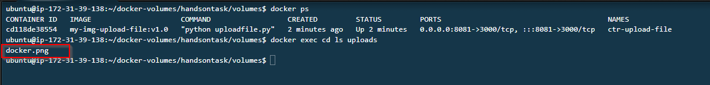


Stop the container:

```shell
docker stop <containerid>
```

Run the container with the Docker volume again:

```shell
docker run --rm -d -p 8081:3000 --name ctr-upload-file -v upload-files:/app/uploads tcb-img-upload-file:v1.0
```
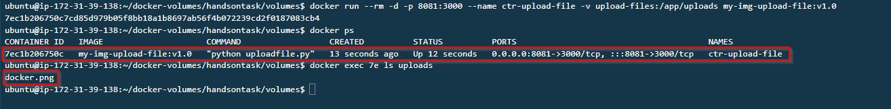

This setup ensures data stored in the volume survives container restarts or replacements. Volume persistence is crucial for databases, file storage, and other stateful applications.


# Step 9: Bind Mount - Folder/Directory Persistence Managed by You:

Stop the container:

```shell 
docker stop <containerid>
```

Create a backup directory and get the current path:

````shell
mkdir bkp-upload
pwd
````

Run the container with a bind mount:

```shell
docker run --rm -d -p 8081:3000 --name ctr-upload-file -v /home/ubuntu/docker-volumes/handsontask/volumes/bkp-upload:/app/uploads tcb-img-upload-file:v1.0
```
We use bind mounts, giving you control over directory persistence. Bind mounts are perfect for fine-grained control over data storage, especially when working with host-specific paths.

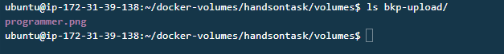

# Step 10: Updating an Application File in Real Time without Building Image Process:

Stop the container:

```shell
docker stop <containerid>
```

Run the container with a bind mount to the `templates` directory:

```shell
docker run --rm -d -p 8081:3000 --name ctr-upload-file -v /home/ubuntu/docker-volumes/handsontask/volumes/templates:/app/templates tcb-img-upload-file:v1.0

```

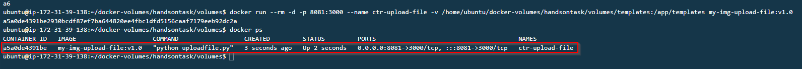

We showcase real-time application file updates without rebuilding the Docker image. This demonstrates how Docker simplifies application maintenance and updates.

Navigated the fascinating world of Docker storage. From understanding basic cleaning practices to mastering data persistence with volumes and bind mounts, you've built a strong foundation for containerized applications. Docker's versatility and scalability make it a fantastic choice for modern DevOps and cloud computing. Happy containerizing! 