**Title: Demystifying Docker Networking: A Hands-On Walkthrough**


**Introduction:**

Docker is a robust platform for containerization, known for its powerful networking capabilities. In this hands-on walkthrough, we will explore various Docker networking modes, create custom networks, and ensure container isolation. Below, you'll find the steps and corresponding commands to follow along.

## **Section 1: Setting the Stage**

1. **Start the AWS EC2 instance running Docker:**
   To embark on this Docker networking journey, you'll need an AWS EC2 instance configured for Docker usage. If you don't have one set up, this is your starting point.

2. **Cleaning the Environment:**
   To ensure a fresh start, clean your Docker environment with the following command:

   ```bash
   docker system prune -a -f --volumes
   ```

## **Section 2: The Scenario**

In our scenario, we have two distinct app servers for different business units within the organization. They must operate independently and remain isolated from each other. To achieve this, we will run each server on its custom network.

## **Section 3: Exploring Default Networks**

1. **List Docker Networks:**
   Start by listing the default Docker networks available using this command:

   ```bash
   docker network ls
   ```
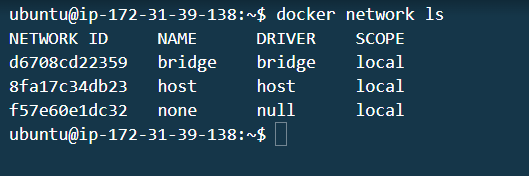
   Docker creates various default networks to manage internal container communication. By listing these networks, you can gain insights into how Docker organizes network connectivity.

2. **Inspect the Default Bridge Network:**
   Dive into the details of Docker's default bridge network:

   ```bash
   docker network inspect bridge
   ```
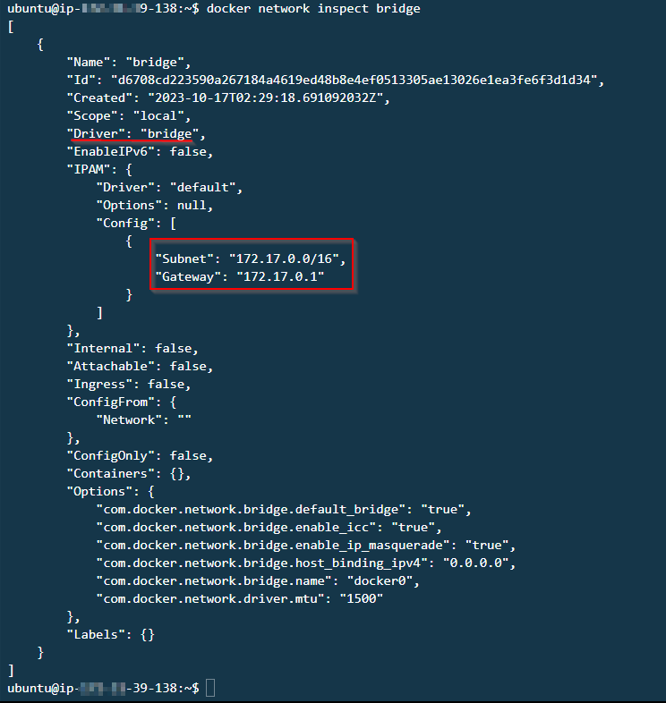
   Examining the bridge network provides a deep understanding of how containers connect to the host machine and the outside world.

3. **Install Bridge Utilities (for Linux only):**
   On Linux systems, install bridge utilities to gain insights into Linux bridging:

   ```bash
   sudo apt install bridge-utils
   ```

   This step is essential for Linux users, as it allows you to interact with the bridge network effectively.

4. **Display a List of Ethernet Bridges:**
   Examine the Ethernet bridges that Docker networks use:

   ```bash
   brctl show
   ```
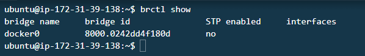
   Understanding these bridges is key to comprehending how Docker manages its internal networks. This knowledge is especially valuable when customizing networks.

## **Section 4: Creating & Connecting to an Ubuntu Container**

1. **Run an Ubuntu Container in Detached Mode:**
   Create detached Ubuntu containers for our experimentation:

   ```bash
   docker run -itd --name my-ubuntu1 ubuntu bash
   docker run -itd --name my-ubuntu2 ubuntu bash
   ```
   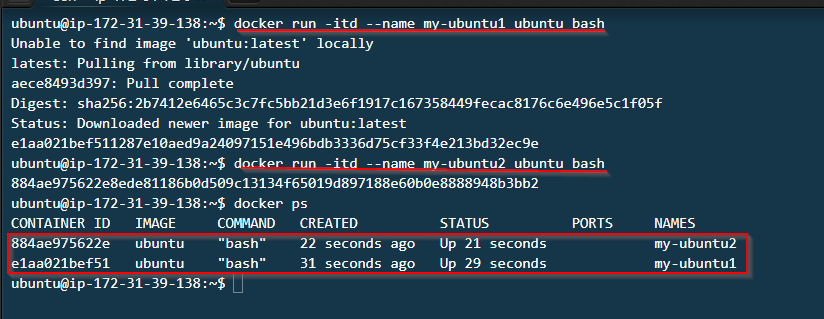

   Access a shell within one of the containers:

   ```bash
   docker exec -it my-ubuntu1 bash
   ```
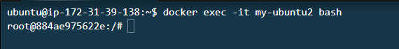
   Running these containers provides the opportunity to explore their network configurations and connectivity.

2. **Update Packages and Install networking tools:**
   Ensure that the containers are well-equipped with networking tool. 

   ```bash
   apt update
   apt install iproute2 -y
   apt install iputils-ping -y
   ```

   By updating and installing these packages, you enable advanced networking capabilities within the containers, such as examining network interfaces and making network-related queries.

3. **Display Network Interface Information & More:**
   Investigate network interfaces, IP addresses, and hostnames within your containers:

   ```bash
   ip a
   ip a | grep global
   hostname -I
   ```
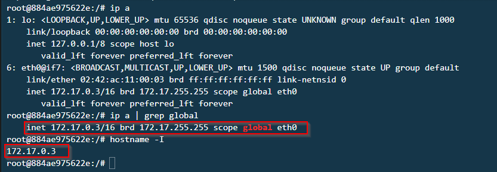
   These commands provide in-depth insights into the network configurations of your containers.

4. **Inspect the Bridge Network Again:**
   Revisit the bridge network after container interaction:

   ```bash
   docker network inspect bridge
   brctl show
   ```
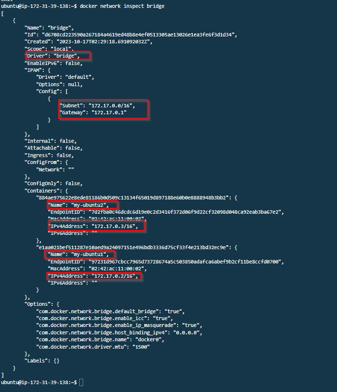
   Now, you can see how the bridge network has been influenced by the presence of your containers.
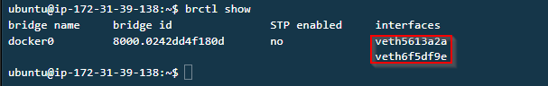
5. **Attempt to Ping Each Container from the Other to Verify Isolation:**
   Validate container isolation by testing their ability to communicate:

   ```bash
   docker exec my-ubuntu1 ping my-ubuntu2
   docker exec my-ubuntu2 ping my-ubuntu1
   ```
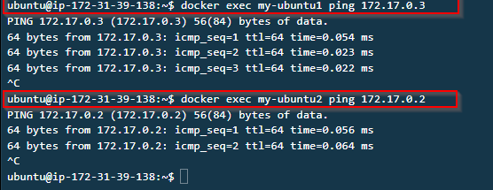
   This step helps ensure that default Docker networking indeed isolates containers from each other by default.

## **Section 5: Creating Custom Networks for Business Units**

1. **Create a New Docker Network for Business Unit 1:**
   Form a custom network dedicated to Business Unit 1:

   ```bash
   docker network create bu1-net
   ```

   Inspect the new network:

   ```bash
   docker network inspect bu1-net
   ```
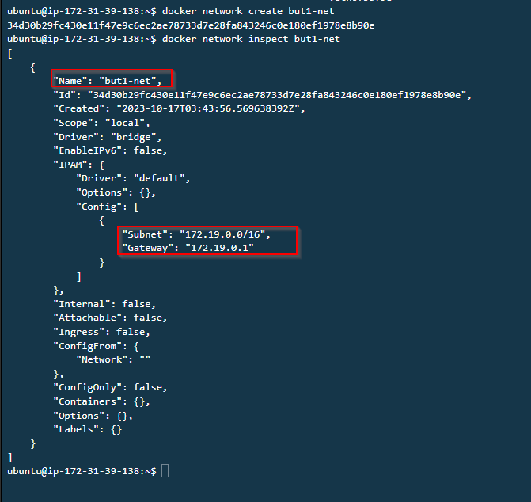
   Custom networks enable you to create isolated environments for different purposes or units within your organization.

2. **Create a New Docker Network for Business Unit 2:**
   Establish a separate custom network for Business Unit 2:

   ```bash
   docker network create bu2-net
   ```

   Inspect the new network:

   ```bash
   docker network inspect bu2-net
   ```
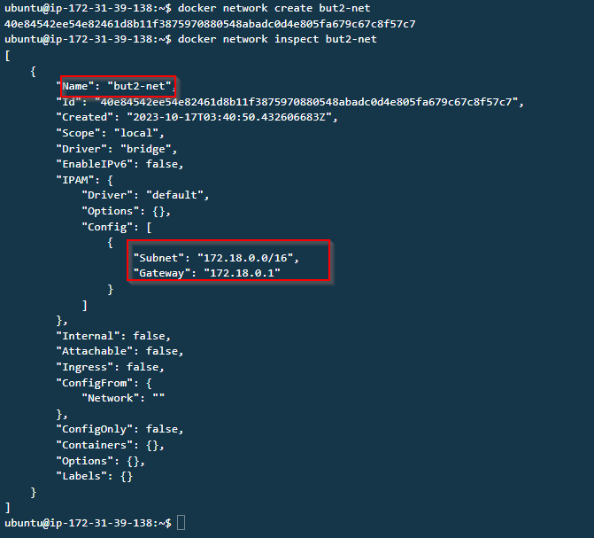
   By creating another custom network, you're preparing to isolate your containers further.

## **Section 6: Connecting Networks to Containers**

1. **Run Linux Containers Connected to BU1's Network:**
   Launch Linux containers connected to the custom network for Business Unit 1:

   ```bash
   docker run -itd --name bu1-linux --net bu1-net ubuntu bash
   ```

   These containers will be dedicated to Business Unit 1, and they'll be on a network separate from other containers.

2. **Run Linux Containers Connected to BU2's Network:**
   Add containers to the custom network for Business Unit 2:

   ```bash
   docker run -itd --name bu2-linux --net bu2-net ubuntu bash
   ```

   These containers, dedicated to Business Unit 2, reside on their custom network.

3. **Inspect the Containers to Confirm They Are on Different Networks:**
   Verify that the containers belong to their respective networks:

   ```bash
   docker inspect bu1-linux
   docker inspect bu2-linux
   ```

   This inspection ensures that your containers are correctly placed on the custom networks.

## **Section 7: Verifying Isolation**

1. **Update Packages and Install network tools:**
   Equip containers with the necessary networking tools:

   ```bash
   docker exec -it bu1-linux bash
   apt update
   apt install iputils-ping -y

   docker exec -it bu2-linux bash
   apt update
   apt install iputils-ping -y
   ```

   By providing these tools, you'll facilitate network testing within the containers.

2. **Attempt to Ping Each Container from the Other to Verify Isolation:**
   Validate the isolation by testing container-to-container communication:

   ```bash
   docker exec bu1-linux ping <ip_bu2-linux>
   docker exec bu2-linux ping <ip_bu1-linux>
   ```
   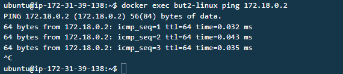
   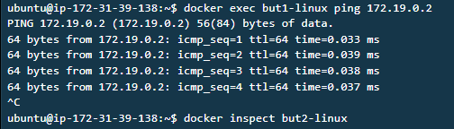

   Ensuring that containers on different custom networks cannot communicate directly is a vital aspect of network isolation.

## **Section 8: Disconnecting & Removing Networks**

1. **Disconnect Your Networks from the Containers:**
   Learn how to disconnect containers from custom networks:

   ```bash
   docker network disconnect bu1-net bu1-linux
   docker network disconnect bu2-net bu2-linux
   ```

   Disconnecting containers from networks is an essential skill for

 managing network associations effectively.

2. **Remove Your Networks:**
   Clean up by removing custom networks that are no longer needed:

   ```bash
   docker network rm bu1-net bu2-net
   ```

   Removing networks is part of maintaining a tidy and efficient Docker environment.

**Wrap Up:**
Docker networking is a powerful feature that allows you to tailor your container environments to specific needs. We hope this hands-on walkthrough has demystified Docker networking for you. If you want to explore even more advanced networking features, refer to the [Docker Networking documentation](https://docs.docker.com/network/) for further insights.

Let's master Docker networking together and open new horizons in containerization! 🐳🌐🔗

# Docker #DockerNetworking #HandsOn #Containerization #Networking #DevOps #Tech #MediumPost
