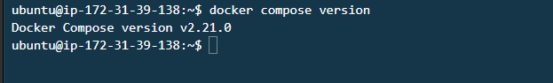
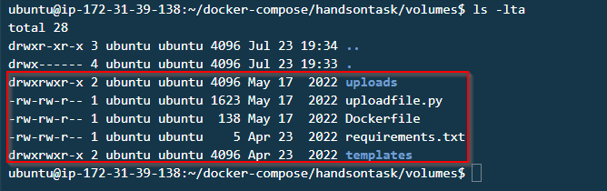
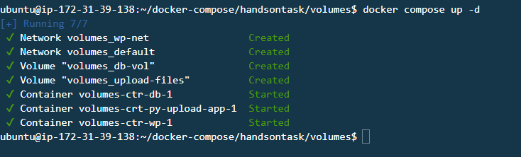
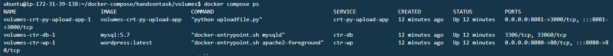
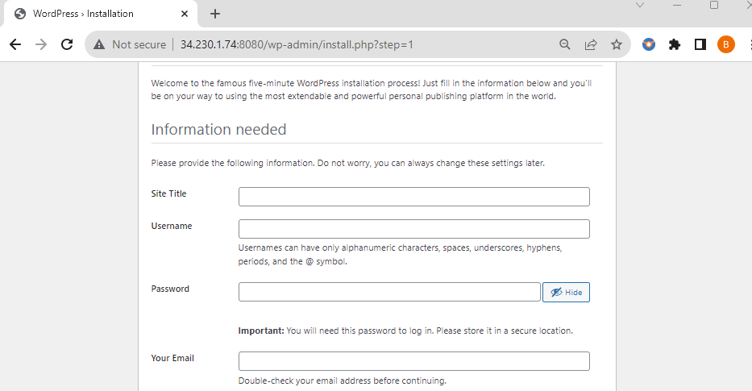
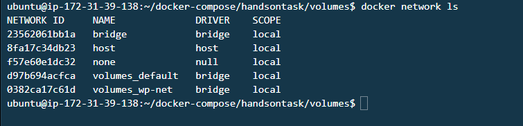
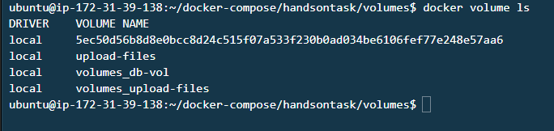
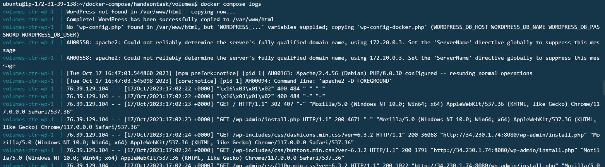
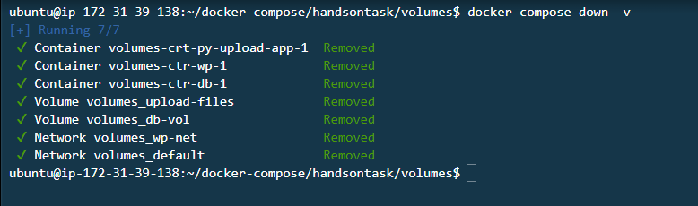

# Mastering Multi-Container Applications with Docker Compose

In the ever-evolving landscape of containerization, Docker Compose emerges as a versatile tool that simplifies the orchestration of multi-container applications. This hands-on guide takes you through the process of using Docker Compose to create a multi-container environment for a WordPress website and a Python file upload service. By the end of this journey, you'll have a comprehensive understanding of how to harness the power of Docker Compose for your projects.

**Step 1: Preparing Your Environment**

Before you embark on the Docker Compose adventure, ensure you have a well-prepared environment:

1. Fire up an AWS EC2 instance with Docker already installed.

2. Let's start fresh. Clean your Docker environment to eliminate any potential conflicts:

   ```bash
   docker system prune -a -f --volumes
   ```

**Step 2: Installing Docker Compose**

In case Docker Compose isn't already part of your toolkit, follow these installation steps:

1. Install Docker Compose by referring to the official [Docker Compose Installation Guide](https://docs.docker.com/compose/install/linux/). This ensures you have the latest version. If you're using an EC2 instance with Ubuntu 22.04, Docker Compose is already pre-installed, saving you some effort.

   ```bash
   sudo apt-get update
   sudo apt-get install docker-compose
   ```

2. To validate the installation, check the version of Docker Compose:

   ```bash
   docker compose version
   ```

**Step 3: Setting Up Your Project Directory**

Create a new directory to serve as the home for your Docker Compose project. Download the essential project files into this directory:

```bash
mkdir docker-compose
cd docker-compose

wget https://tcb-bootcamps.s3.amazonaws.com/tcb5001-devopscloud-bootcamp/v2/module5-docker/files/module5-docker.zip

unzip module5-docker.zip
cd handsontask/volumes
```


In a Docker swarm environment go ahead to Craft the Docker compose file let's gerate a random alphanumeric password for MySQL database and mysql root password and store it as a Docker secret with the name `mysql_password` and  `mysql_root_password` respectively using `docker secret create` command. To make the password shorter or longer, adjust the last argument of the `openssl` command. This is just one way to create a relatively random password.

```bash
$ openssl rand -base64 20 | docker secret create mysql_password -
$ openssl rand -base64 20 | docker secret create mysql_root_password -
```

List the secrets managed by Docker using docker secret ls:
```bash
docker secret ls
```

*Another security best practice, is to create an environmental variable and set the value pointing to an external source like a password manager* 

Learm more abour security best practicies [here](https://docs.docker.com/engine/swarm/secrets/)

in this scanario we will just specify the password in the docker file. 

**Step 4: Crafting the Docker Compose File**

The heart of your Docker Compose project is the Docker Compose YAML file, named `docker-compose.yaml`. This file serves as the blueprint for your application, defining services, networks, volumes, and their configurations.

The YAML file below sets up three services: a MySQL database for WordPress, the WordPress application itself, and a Python-based file upload service.

```yaml
version: '3'

services:
  ctr-db:
    image: mysql:5.7
    volumes:
      - db-vol:/var/lib/mysql
    environment:
      MYSQL_ROOT_PASSWORD: wordpress
      MYSQL_DATABASE: wordpress
      MYSQL_USER: devopscloudbootcamp
      MYSQL_PASSWORD: devopscloudbootcamp
    networks:
      - wp-net
    restart: always

  ctr-wp:
    image: wordpress:latest
    ports:
      - "8080:80"
    environment:
      WORDPRESS_DB_HOST: ctr-db:3306
      WORDPRESS_DB_USER: devopscloudbootcamp
      WORDPRESS_DB_PASSWORD: devopscloudbootcamp
      WORDPRESS_DB_NAME: wordpress
    networks:
      - wp-net
    restart: always
    depends_on:
      - ctr-db
  
  crt-py-upload-app:
    build:
      context: .
      dockerfile: Dockerfile
    ports:
      - "8081:3000"
    volumes:
      - upload-files:/app/uploads
    restart: always

volumes:
  db-vol: {}
  upload-files: {}
networks:
  wp-net: {}
```

**Step 5: Starting Your Docker Compose**

It's showtime! You're ready to launch your multi-container application using Docker Compose:

```bash
docker compose up
```

In case you need to halt your Docker Compose environment, press `CTRL + C`.

To run Docker Compose in detached mode:

```bash
docker compose up -d
```

**Step 6: Managing Your Docker Compose Services**

- Verify the status of your Docker Compose services:

   ```bash
   docker compose ps
   ```




- Administer your containers as needed:

   ```bash
   docker compose stop
   docker compose start
   docker compose pause
   docker compose unpause
   ```
The pause command is useful in scenario where you are trying to do an upgrade or change a setting in the application and you don't want users to get access to it at that particular time. Once done you can up

**Step 7: Exploring Your Docker Environment**

Now that your Docker Compose environment is up and running, you can explore it further:

- List the running Docker containers:

   ```bash
   docker ps
   ```

- Discover the Docker networks you've created:

   ```bash
   docker network ls
   ```

- Examine the Docker volumes you're working with:

   ```bash
   docker volume ls
   ```
   
- Examine Logs to view activities being executed on our container environment managed by docker compose and for trouble shooting purposes.

```bash
docker compose logs
```



**Step 8: Cleaning Up Your Docker Compose**

When you've accomplished your mission with Docker Compose, it's good practice to wrap things up: This will stop the containers and remove the containers, volumes and networks all created by docker compose for the upload files and database. 

```bash
docker compose down -v
```


Docker Compose is a potent tool for managing intricate containerized applications. With this guide, you've mastered the art of orchestrating multi-container setups, greatly enhancing your development and testing workflows. Now, you're ready to tackle your containerization projects with confidence. Happy containerizing! 🐳🚀